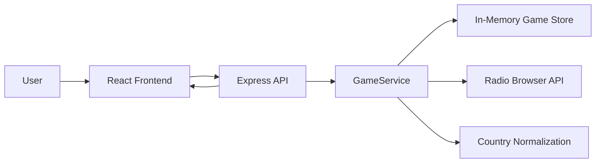
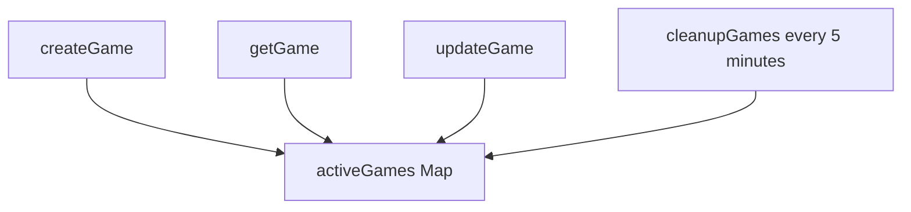
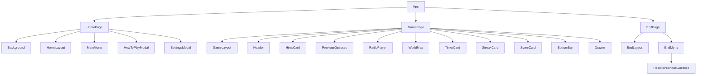
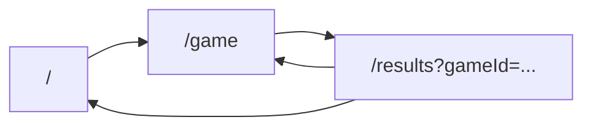
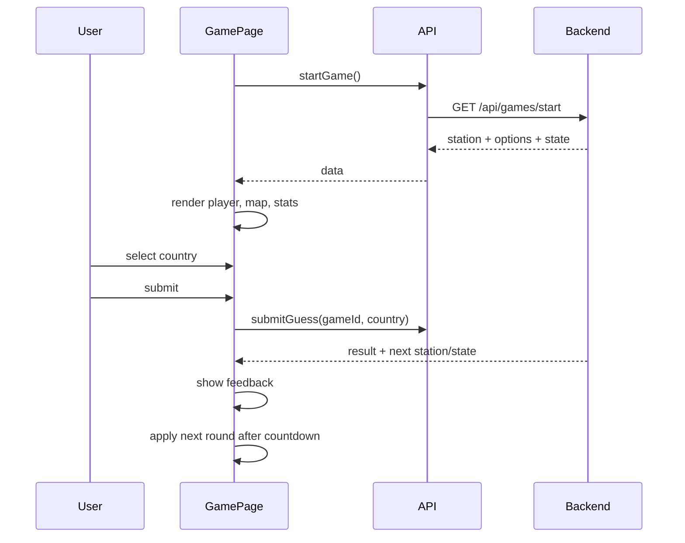
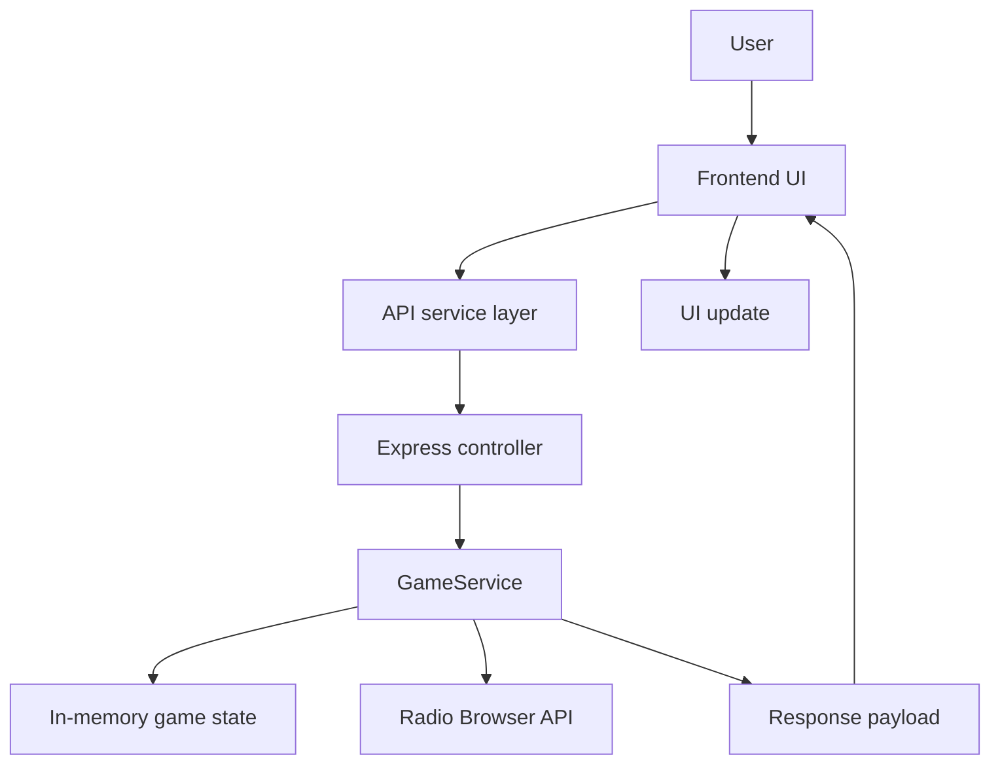
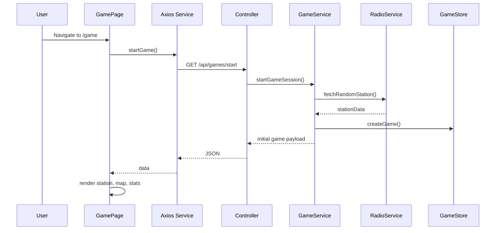
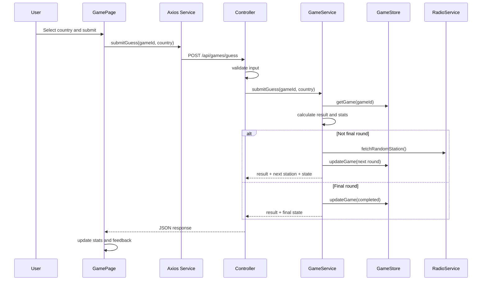

# Radio Hunt Engineering Guide

## 1. Project Overview

### What Radio Hunt Is

Radio Hunt is an interactive geography and audio trivia game. A player listens to a live radio station stream, sees four highlighted country options on a world map, and guesses which country the station is broadcasting from. The game is designed around exploration, pattern recognition, language recognition, and geographic intuition.

### How It Works

The application is split into a React frontend and an Express backend:

- The frontend renders the game interface, audio player, map, timer, score/streak cards, previous guesses, and results page.
- The backend owns gameplay state and all gameplay calculations.
- The backend fetches live station data from the Radio Browser API.
- The backend normalizes Radio Browser country names to match the map geometry country names used by the frontend.
- Each game runs for `10` rounds.

### Gameplay Loop

1. The player starts a game from the home page.
2. The frontend calls the backend start endpoint.
3. The backend selects a playable random station and generates four country options.
4. The frontend plays the station and highlights the four possible countries.
5. The player selects a highlighted country.
6. The player submits a guess.
7. The backend validates the guess, updates score/streak/statistics, records previous guesses, and either:
   - prepares the next station, or
   - marks the game complete after round 10.
8. The frontend shows feedback, waits for the existing countdown, and advances to the next round.
9. At game over, the player can view the results page.

### Target Users

Primary target users:

- Geography game players.
- People interested in world cultures, languages, and music.
- Casual web game users.
- Portfolio reviewers evaluating interactive full-stack engineering work.

Secondary target users:

- Educators or students using audio and geography as a learning aid.
- Developers reviewing the project for maintainability and architecture.

### Current Technology Stack

Backend:

- Node.js
- Express 5
- Axios
- CORS
- dotenv dependency installed, but not currently loaded in `server.js`
- In-memory `Map` for active game sessions
- Radio Browser public API
- `world-atlas`, `topojson-client`, and `fastest-levenshtein` for country tooling scripts

Frontend:

- React 18
- Vite
- React Router
- Axios
- CSS Modules
- Framer Motion
- React Icons
- React Simple Maps
- Three.js dependencies are installed, but the current primary map is SVG-based via React Simple Maps

### Overall Architecture



The project currently uses a small monorepo structure:

```text
Radio hunt/
  backend/
    src/
      constants/
      controllers/
      routes/
      services/
      utils/
      server.js
    scripts/
  frontend/
    src/
      components/
      constants/
      hooks/
      pages/
      services/
```

## 2. Gameplay Logic

### Game Start Flow

Entry point:

- Frontend: `startGame()` in `frontend/src/services/radioService.js`
- API: `GET /api/games/start`
- Controller: `startGame`
- Service: `startGameSession`

Flow:

1. Frontend navigates to `/game`.
2. `GamePage` calls `loadGame`.
3. `loadGame` calls `startGame`.
4. Backend `startGame` controller delegates to `startGameSession`.
5. `startGameSession` calls `prepareNextStation`.
6. `prepareNextStation` fetches a random playable station.
7. The station's country is normalized.
8. Four options are generated, including the correct country.
9. A new game ID is generated with `crypto.randomUUID()`.
10. Initial game state is saved in `gameStore`.
11. The backend returns station data, options, hints, and initial game state.

Initial state:

```js
{
  score: 0,
  streak: 0,
  bestStreak: 0,
  correctGuesses: 0,
  incorrectGuesses: 0,
  currentRound: 1,
  previousGuesses: [],
  completed: false,
  currentStation: {
    country: normalizedCountry,
    stationUuid: stationData.stationuuid
  }
}
```

### Station Selection

Station selection is handled by `fetchRandomStation` in `backend/src/services/radio.service.js`.

Current behavior:

1. Use hardcoded Radio Browser base URL:
   - `https://de1.api.radio-browser.info`
2. Fetch countries from `/json/countries`.
3. Cache the countries in module memory.
4. Keep only countries with at least `30` stations.
5. Try up to `20` random countries.
6. For each country, fetch stations by country.
7. Filter stations to playable candidates:
   - `url_resolved` exists.
   - stream URL starts with `https://`.
   - `lastcheckok === 1`.
   - codec is `MP3` or `AAC`.
8. Return a random playable station.
9. If no playable station is found after 20 attempts, throw an error.

### Country Normalization

Country normalization exists because Radio Browser country names do not always match the country names in the map geometry.

Example mappings:

- `"The United States Of America"` -> `"United States of America"`
- `"The Russian Federation"` -> `"Russia"`
- `"The Republic Of Korea"` -> `"South Korea"`
- `"Bosnia And Herzegovina"` -> `"Bosnia and Herz."`

Normalization files:

- `backend/src/utils/normalizeCountry.js`
- `backend/src/utils/unsupportedCountries.js`

Important detail:

- The frontend map compares option strings directly against `geo.properties.name` from `world-atlas`.
- If normalized names do not match the map geometry exactly, countries will not highlight or be selectable.

### Guess Submission Flow

Entry point:

- Frontend: `submitGuess(gameId, country)`
- API: `POST /api/games/guess`
- Controller: `checkGuess`
- Service: `submitGuess`

Flow:

1. Frontend passes `gameId` and selected country name.
2. Controller validates both are present.
3. Service loads game from `gameStore`.
4. If no game exists, backend returns `404`.
5. If game is already complete, backend returns `409` with current completed state.
6. Service compares submitted country with `game.currentStation.country`.
7. Service builds a guess record.
8. Service updates score, streak, best streak, guess counts, and previous guesses.
9. If the round is the final round, service marks the game complete.
10. If not final round, service prepares the next station and advances `currentRound`.
11. Response is returned to the frontend.

### Correct Answer Flow

Correctness check:

```js
game.currentStation.country.trim().toLowerCase() === country.trim().toLowerCase()
```

If correct:

- `correct` is `true`.
- Score increases by `SCORE_PER_CORRECT_GUESS`.
- Current streak increments by `1`.
- Best streak becomes `Math.max(previousBestStreak, newStreak)`.
- Correct guesses increments by `1`.
- Incorrect guesses does not change.
- Previous guesses receives a new record.

### Incorrect Answer Flow

If incorrect:

- `correct` is `false`.
- Score does not change.
- Current streak resets to `0`.
- Best streak remains unchanged.
- Correct guesses does not change.
- Incorrect guesses increments by `1`.
- Previous guesses receives a new record with both guessed and correct country.

Timer expiration uses the same incorrect-answer path by submitting `"No answer"`.

### Score Calculation

Constant:

```js
SCORE_PER_CORRECT_GUESS = 100
```

Formula:

```js
score = previousScore + (guess.correct ? 100 : 0)
```

There is currently no time bonus, streak bonus, difficulty multiplier, or penalty.

### Streak Calculation

Formula:

```js
streak = guess.correct ? previousStreak + 1 : 0
```

The streak represents consecutive correct answers ending at the latest guess.

### Best Streak Calculation

Formula:

```js
bestStreak = Math.max(previousBestStreak, currentStreak)
```

Best streak only changes when a correct answer creates a new high streak.

### Accuracy Calculation

Accuracy is derived, not directly stored as the source of truth.

Formula:

```js
accuracy = totalGuesses === 0
  ? 0
  : Math.round((correctGuesses / totalGuesses) * 100)
```

Examples:

- 0 correct out of 0 guesses -> `0`
- 2 correct out of 3 guesses -> `67`
- 6 correct out of 10 guesses -> `60`

### Round Progression

Initial round:

- `currentRound = 1`

After non-final guess:

- Backend prepares the next station.
- `currentRound` increments by `1`.
- `currentStation` changes to the next station.
- Response includes next round `streamUrl`, `stationName`, `options`, and `hints`.

After final guess:

- `currentRound` remains `10`.
- `completed` becomes `true`.
- `completedAt` is set.
- No next station is returned.
- `gameOver` is returned as `true`.

Remaining rounds:

```js
remainingRounds = game.completed ? 0 : Math.max(MAX_ROUNDS - currentRound, 0)
```

### Previous Guesses

Each submitted guess appends:

```js
{
  guessedCountry: string,
  correctCountry: string,
  correct: boolean
}
```

Previous guesses are used by:

- Game drawer
- Sidebar previous guess list
- Results page
- Accuracy calculation fallback

### Timer Behavior

Timer is frontend-owned UI behavior.

Current behavior:

- `ROUND_SECONDS = 45`.
- Timer starts after game data loads.
- Timer pauses when interaction is locked.
- Timer pauses when a round is finished.
- If timer reaches `0`, frontend calls `submitCurrentGuess("No answer")`.
- Backend treats `"No answer"` as a normal incorrect guess.
- After a guess, the feedback countdown runs for `5` seconds.
- When feedback countdown reaches `0`, frontend applies the next round data already returned by the backend.

Important boundary:

- Backend does not enforce time limits.
- A malicious or custom client could submit after 45 seconds.
- Timer integrity is currently a frontend UX feature, not a backend rule.

### End Game Logic

The backend ends the game when:

```js
game.currentRound >= MAX_ROUNDS
```

On final submission:

- The guess is recorded.
- Score and stats are updated.
- `completed` is set to `true`.
- `completedAt` is set to `Date.now()`.
- Response includes `gameOver: true`.

The frontend then enables the "View Results" flow.

### Results Page

Frontend route:

- `/results?gameId=<id>`

API call:

- `GET /api/games/:gameId/results`

Results shown:

- Score
- Accuracy
- Correct count
- Incorrect count
- Best streak
- Final streak
- Previous guesses

Results are only available while the in-memory game state remains available.

### Skip Logic Current Status

Status: Partial / Missing.

Current frontend:

- Skip button exists in `BottomBar`.
- `handleSkip` only logs `"Skip"`.

Current backend:

- No skip endpoint.
- No skip service function.
- No skipped count.
- No skip state transition.

Current gameplay:

- Skip is not functional.

### Edge Cases

Handled:

- Missing `gameId` or `country` in guess request -> `400`.
- Missing `gameId` in results request -> `400`.
- Unknown game -> `404`.
- Results requested before completion -> `409`.
- Guess submitted after game completion -> `409` plus game state.
- No playable station found after retries -> `500` from start or guess endpoint.

Partially handled:

- Radio Browser failures are caught at endpoint level, but retry strategy is limited.
- Broken streams are filtered heuristically, but playback can still fail.
- Unsupported map countries are filtered from generated options, but station correctness depends on normalization coverage.

Not handled:

- Concurrent submissions for the same game from multiple clients.
- Backend-enforced timer expiration.
- Duplicate guesses after network retry.
- Persistent results after server restart.
- Multi-instance game state sharing.

### Failure Handling

Backend:

- Controller wraps service calls in centralized error handling.
- Known `GameServiceError` responses return their status and message.
- Unknown errors return endpoint-specific `500` responses.

Frontend:

- Game page logs start and submission errors.
- Results page shows user-facing messages for `404`, `409`, and generic failure.
- Toast notifications are not implemented.

## 3. Backend Architecture

### Folder Structure

```text
backend/
  package.json
  src/
    server.js
    constants/
      countries.json
      game.constants.js
    controllers/
      game.controller.js
    routes/
      game.routes.js
    services/
      game.service.js
      radio.service.js
    utils/
      createOptions.js
      gameStore.js
      normalizeCountry.js
      unsupportedCountries.js
  scripts/
    generateNormalizedCountries.js
    generateUnsupportedCountries.js
```

### Folder Responsibilities

`src/server.js`:

- Creates the Express app.
- Configures CORS.
- Configures JSON body parsing.
- Registers routes.
- Starts cleanup interval for expired games.
- Starts the HTTP server.

`src/constants/`:

- Static values used by backend logic.
- `game.constants.js` defines `MAX_ROUNDS` and `SCORE_PER_CORRECT_GUESS`.
- `countries.json` contains Radio Browser country data.

`src/controllers/`:

- HTTP boundary.
- Validates request shape.
- Calls service functions.
- Sends JSON responses.
- Handles service and unexpected errors.

`src/routes/`:

- Maps URL paths to controller handlers.

`src/services/`:

- Owns business workflows and external API communication.
- `game.service.js` owns gameplay rules and game state transitions.
- `radio.service.js` owns Radio Browser station/country fetching.

`src/utils/`:

- Small reusable helpers and state primitives.
- `gameStore.js` owns in-memory storage operations.
- `createOptions.js` generates four country options.
- `normalizeCountry.js` maps external country names to map names.
- `unsupportedCountries.js` lists countries not supported by the map.

`scripts/`:

- Developer tooling for country normalization and unsupported country generation.
- These scripts are not part of runtime request handling.

### Controller Responsibilities

`game.controller.js`:

- `startGame`
  - Calls `startGameSession`.
  - Returns game payload.
- `checkGuess`
  - Validates `gameId` and `country`.
  - Calls `submitGuess`.
  - Returns guess result and game state.
- `getGameResults`
  - Validates `gameId`.
  - Calls `getCompletedGameResults`.
  - Returns final game state.

Controllers should not:

- Calculate score.
- Advance rounds.
- Fetch stations directly.
- Update game store directly.
- Normalize countries directly.

### Service Responsibilities

`game.service.js`:

- Starts games.
- Applies guesses.
- Calculates score and statistics.
- Determines correct/incorrect answers.
- Advances rounds.
- Ends games.
- Serializes game state for API responses.
- Throws `GameServiceError` for expected domain failures.

`radio.service.js`:

- Fetches country list.
- Caches valid countries in memory.
- Fetches stations by random country.
- Filters playable stations.
- Returns a random playable station.

### Utility Responsibilities

`gameStore.js`:

- `createGame(gameId, gameData)`
- `getGame(gameId)`
- `updateGame(gameId, updates)`
- `deleteGame(gameId)`
- `cleanupGames()`

`createOptions.js`:

- Reads country constants.
- Normalizes country names.
- Filters unsupported countries.
- Generates four unique shuffled options.

`normalizeCountry.js`:

- Maps Radio Browser names to world-atlas names.

`unsupportedCountries.js`:

- Set of country names that should not appear as options because the map cannot represent them properly.

### Middleware

Current middleware:

- `cors`
- `express.json()`

No custom middleware folder currently exists.

Missing middleware opportunities:

- Request logging.
- Rate limiting.
- Request validation.
- Error handling middleware.
- Security headers.

### Constants

Runtime constants:

- `MAX_ROUNDS = 10`
- `SCORE_PER_CORRECT_GUESS = 100`

Operational constants in `radio.service.js`:

- `TIMEOUT = 10000`
- `RADIO_BROWSER_URL = "https://de1.api.radio-browser.info"`

### Game State Management

Game state is stored in a module-level `Map`.

Characteristics:

- Fast and simple.
- Not persistent.
- Not shared across backend instances.
- Cleared on process restart.
- Cleaned up after one hour by `cleanupGames`.



### Current API Design

```text
GET  /
GET  /api/games/start
POST /api/games/guess
GET  /api/games/:gameId/results
```

Design notes:

- The API is minimal and frontend-specific.
- `GET /api/games/start` mutates state, which is not RESTful.
- The API returns full game state after major operations.
- The frontend depends on the current top-level response shape.

## 4. Frontend Architecture

### Folder Structure

```text
frontend/src/
  App.jsx
  main.jsx
  index.css
  components/
    background/
    game/
    home/
    layout/
    map/
    player/
    ui/
  constants/
  hooks/
  pages/
  services/
```

### Component Hierarchy



### State Management

Current state management is local React state in `GamePage`.

Important state:

- `game`
- `nextRound`
- `selectedCountry`
- `correctCountry`
- `guessResult`
- `interactionLocked`
- `roundFinished`
- `gameOver`
- `timeLeft`
- `feedbackLocked`
- `isSubmitting`
- `feedbackTimeLeft`
- drawer/modal state
- audio mute state

There is no global store.

### Hooks

Used hooks:

- React built-ins: `useState`, `useEffect`, `useCallback`, `useRef`
- Custom hook: `useMapZoom`

Important note:

- `useMapZoom` exists but is currently unused by `WorldMap`.
- `WorldMap` implements its own zoom/pan behavior with `ZoomableGroup` and event listeners.

### Page Flow



### Data Flow

Start:

1. `HomePage` navigates to `/game`.
2. `GamePage` calls `startGame`.
3. Response is stored in `game`.
4. UI renders stream, options, stats, hints, and previous guesses.

Guess:

1. User selects a map country.
2. `selectedCountry` updates.
3. User submits guess.
4. Frontend calls `submitGuess`.
5. Backend response updates current visible stats and previous guesses.
6. Next-round data is stored in `nextRound`.
7. Feedback countdown completes.
8. `applyNextRound(nextRound)` swaps station/map/options.

Results:

1. User clicks "View Results".
2. Frontend navigates to `/results?gameId=...`.
3. `EndPage` calls `getGameResults`.
4. Results are displayed in `EndMenu`.

### API Interactions

`frontend/src/services/api.js`:

- Creates an Axios instance using `import.meta.env.VITE_API_URL`.

`frontend/src/services/radioService.js`:

- `startGame()`
- `submitGuess(gameId, country)`
- `getGameResults(gameId)`

### Audio Handling

`RadioPlayer`:

- Receives `streamUrl`, `stationName`, and `audioRef`.
- Loads the station URL into an `<audio>` element.
- Attempts autoplay.
- Handles blocked autoplay by showing a blocked status.
- Allows manual play by clicking the player icon.
- Tracks statuses:
  - `idle`
  - `connecting`
  - `buffering`
  - `playing`
  - `blocked`
  - `error`

Current limitations:

- No retry on stream failure.
- No stream health check from frontend.
- No volume persistence.
- No station metadata display beyond name/status.

### Map Handling

`WorldMap`:

- Uses `react-simple-maps`.
- Loads map geometry from:
  - `https://cdn.jsdelivr.net/npm/world-atlas@2/countries-50m.json`
- Highlights four option countries.
- Allows selection only on option countries.
- Locks interactions after submission.
- Shows:
  - default countries
  - option countries
  - selected country
  - correct country
  - wrong selected country

Zoom behavior:

- Local `zoom` state.
- Local `center` state.
- Wheel zoom.
- Touch prevention.
- Drag-vs-click detection.

### Timer Handling

Timer is implemented in `GamePage` and displayed by `TimerCard`.

Behavior:

- Starts at `45` seconds.
- Decrements once per second.
- Stops when round is locked or finished.
- Auto-submits `"No answer"` at zero.
- Feedback countdown displays "Next Round In" mode.
- Next round is applied after feedback countdown.

### Rendering Flow



## 5. API Documentation

### GET `/`

Purpose:

- Health/basic status endpoint.

Request body:

- None.

Response:

```json
{
  "message": "Backend working"
}
```

Possible errors:

- None expected under normal operation.

Example request:

```bash
curl http://localhost:5000/
```

Example response:

```json
{
  "message": "Backend working"
}
```

### GET `/api/games/start`

Purpose:

- Starts a new game session.
- Fetches the first station.
- Generates options.
- Returns initial game state.

Request body:

- None.

Validation:

- None.

Response fields:

- `gameId`
- `streamUrl`
- `stationName`
- `options`
- `hints`
- `score`
- `streak`
- `bestStreak`
- `currentRound`
- `maxRounds`
- `remainingRounds`
- `correctGuesses`
- `incorrectGuesses`
- `accuracy`
- `previousGuesses`
- `gameOver`

Example request:

```bash
curl http://localhost:5000/api/games/start
```

Example response:

```json
{
  "gameId": "7191672b-93e9-41ab-9f5f-33b487ba1f87",
  "streamUrl": "https://example-stream.test/live.mp3",
  "stationName": "Example Radio",
  "options": ["Germany", "Brazil", "Japan", "Kenya"],
  "hints": {
    "language": "English",
    "continent": "Unknown",
    "timeZone": "Unknown",
    "listeners": "12"
  },
  "score": 0,
  "streak": 0,
  "bestStreak": 0,
  "currentRound": 1,
  "maxRounds": 10,
  "remainingRounds": 9,
  "correctGuesses": 0,
  "incorrectGuesses": 0,
  "accuracy": 0,
  "previousGuesses": [],
  "gameOver": false
}
```

Possible errors:

```json
{
  "error": "Failed to start game"
}
```

Typical causes:

- Radio Browser unavailable.
- No playable station found after retry attempts.
- Country/options generation failure.

### POST `/api/games/guess`

Purpose:

- Submits a guess for the current round.
- Updates gameplay state.
- Returns result and either next station data or final game state.

Request body:

```json
{
  "gameId": "7191672b-93e9-41ab-9f5f-33b487ba1f87",
  "country": "Germany"
}
```

Validation:

- `gameId` is required.
- `country` is required.

Successful non-final response:

```json
{
  "correct": true,
  "correctCountry": "Germany",
  "streamUrl": "https://next-stream.test/live.mp3",
  "stationName": "Next Radio",
  "options": ["France", "Canada", "Mexico", "Spain"],
  "hints": {
    "language": "Spanish",
    "continent": "Unknown",
    "timeZone": "Unknown",
    "listeners": "5"
  },
  "score": 100,
  "streak": 1,
  "bestStreak": 1,
  "currentRound": 2,
  "maxRounds": 10,
  "remainingRounds": 8,
  "correctGuesses": 1,
  "incorrectGuesses": 0,
  "accuracy": 100,
  "previousGuesses": [
    {
      "guessedCountry": "Germany",
      "correctCountry": "Germany",
      "correct": true
    }
  ],
  "gameOver": false
}
```

Successful final response:

```json
{
  "correct": false,
  "correctCountry": "Brazil",
  "score": 600,
  "streak": 0,
  "bestStreak": 3,
  "currentRound": 10,
  "maxRounds": 10,
  "remainingRounds": 0,
  "correctGuesses": 6,
  "incorrectGuesses": 4,
  "accuracy": 60,
  "previousGuesses": [],
  "gameOver": true
}
```

Possible errors:

Missing input:

```json
{
  "message": "gameId and country are required"
}
```

Unknown game:

```json
{
  "message": "Game not found"
}
```

Game already complete:

```json
{
  "message": "Game is already complete",
  "score": 600,
  "streak": 0,
  "bestStreak": 3,
  "currentRound": 10,
  "maxRounds": 10,
  "remainingRounds": 0,
  "correctGuesses": 6,
  "incorrectGuesses": 4,
  "accuracy": 60,
  "previousGuesses": [],
  "gameOver": true
}
```

Unexpected failure:

```json
{
  "message": "Failed to check guess"
}
```

### GET `/api/games/:gameId/results`

Purpose:

- Returns final game state for a completed game.

Request body:

- None.

URL params:

- `gameId`: required.

Example request:

```bash
curl http://localhost:5000/api/games/7191672b-93e9-41ab-9f5f-33b487ba1f87/results
```

Example response:

```json
{
  "score": 600,
  "streak": 0,
  "bestStreak": 3,
  "currentRound": 10,
  "maxRounds": 10,
  "remainingRounds": 0,
  "correctGuesses": 6,
  "incorrectGuesses": 4,
  "accuracy": 60,
  "previousGuesses": [
    {
      "guessedCountry": "Kenya",
      "correctCountry": "Kenya",
      "correct": true
    }
  ],
  "gameOver": true
}
```

Possible errors:

Missing game ID:

```json
{
  "message": "gameId is required"
}
```

Unknown or expired game:

```json
{
  "message": "Game results not found"
}
```

Game not complete:

```json
{
  "message": "Game is not complete yet"
}
```

Unexpected failure:

```json
{
  "message": "Failed to fetch game results"
}
```

## 6. Game State

### Stored Properties

| Property | Type | Initial Value | Purpose | Changes When | Modified By |
|---|---:|---:|---|---|---|
| `score` | number | `0` | Total points earned | Correct guess | `applyGuess`, `updateGame` |
| `streak` | number | `0` | Current consecutive correct guesses | Every guess | `applyGuess`, `updateGame` |
| `bestStreak` | number | `0` | Highest streak in current game | Correct guess creates new high | `applyGuess`, `updateGame` |
| `correctGuesses` | number | `0` | Count of correct answers | Correct guess | `applyGuess`, `updateGame` |
| `incorrectGuesses` | number | `0` | Count of incorrect answers | Incorrect guess, including timeout | `applyGuess`, `updateGame` |
| `currentRound` | number | `1` | Current round number | Non-final guess advances round | `submitGuess`, `updateGame` |
| `previousGuesses` | array | `[]` | Guess history | Every submitted guess | `applyGuess`, `updateGame` |
| `completed` | boolean | `false` | Whether game is over | Final guess | `submitGuess`, `updateGame` |
| `completedAt` | number | absent | Completion timestamp | Final guess | `submitGuess`, `updateGame` |
| `currentStation.country` | string | normalized first station country | Correct answer for active round | Game start and non-final round advance | `createInitialGame`, `submitGuess` |
| `currentStation.stationUuid` | string | first station UUID | Station identity | Game start and non-final round advance | `createInitialGame`, `submitGuess` |
| `createdAt` | number | `Date.now()` | Cleanup timestamp | Game creation only | `createGame` |

### Derived Response Properties

| Property | Type | Source | Purpose |
|---|---:|---|---|
| `maxRounds` | number | `MAX_ROUNDS` | Communicates game length to frontend |
| `remainingRounds` | number | `MAX_ROUNDS`, `currentRound`, `completed` | UI round status |
| `accuracy` | number | `correctGuesses / totalGuesses` | Results and stats |
| `gameOver` | boolean | `completed` | Frontend flow control |

## 7. Data Flow

### High-Level Data Flow



### Start Game Data Flow



### Guess Data Flow



## 8. Existing Features

### Gameplay

- ✅ Complete: Start game.
- ✅ Complete: Fetch random station.
- ✅ Complete: Four country options.
- ✅ Complete: Map option highlighting.
- ✅ Complete: Country selection.
- ✅ Complete: Guess submission.
- ✅ Complete: Correct/incorrect feedback coloring.
- ✅ Complete: Score calculation.
- ✅ Complete: Current streak calculation.
- ✅ Complete: Best streak calculation.
- ✅ Complete: Correct/incorrect guess counts.
- ✅ Complete: Accuracy calculation.
- ✅ Complete: Previous guesses.
- ✅ Complete: Ten-round game loop.
- ✅ Complete: Game-over detection.
- ✅ Complete: Results retrieval.
- 🟡 Partial: Timer. Frontend works, backend does not enforce it.
- 🟡 Partial: Hints. Language/listener metadata exists; continent/time zone are unknown.
- ❌ Missing: Skip behavior.
- ❌ Missing: Retry failed station playback from frontend.
- ❌ Missing: Backend-enforced duplicate submission protection.

### Backend

- ✅ Complete: Express server.
- ✅ Complete: Game routes.
- ✅ Complete: Thin controller after service extraction.
- ✅ Complete: Game service.
- ✅ Complete: Radio Browser service.
- ✅ Complete: In-memory game store.
- ✅ Complete: Expired game cleanup.
- ✅ Complete: Country normalization.
- ✅ Complete: Unsupported country filtering.
- 🟡 Partial: Error handling. Centralized in controller, but no global Express error middleware.
- 🟡 Partial: Logging. Console logging only.
- ❌ Missing: Persistent storage.
- ❌ Missing: Rate limiting.
- ❌ Missing: Production monitoring.
- ❌ Missing: Automated backend tests.

### Frontend

- ✅ Complete: Home page.
- ✅ Complete: Game page.
- ✅ Complete: Results page.
- ✅ Complete: Audio player.
- ✅ Complete: Map interaction.
- ✅ Complete: Responsive layout.
- ✅ Complete: Drawers for small screens.
- ✅ Complete: Score/streak display from backend.
- ✅ Complete: Results summary.
- 🟡 Partial: Settings modal placeholder.
- 🟡 Partial: Floating action buttons. Some are visual-only.
- 🟡 Partial: Error user feedback. Many failures log to console.
- ❌ Missing: Toast notifications.
- ❌ Missing: Fullscreen behavior.
- ❌ Missing: Settings functionality.

### Infrastructure

- ✅ Complete: Vite build.
- ✅ Complete: ESLint.
- ✅ Complete: Vercel rewrite config for frontend.
- 🟡 Partial: Environment variable usage. Frontend uses `VITE_API_URL`; backend uses `PORT` but does not load dotenv.
- ❌ Missing: CI pipeline.
- ❌ Missing: Backend deployment config documentation.
- ❌ Missing: Health/readiness endpoint beyond root status.

## 9. Technical Debt

### Critical

#### In-memory game state cannot scale horizontally

Why it matters:

- Games disappear on restart.
- Multiple backend instances would not share sessions.

Impact:

- Production reliability risk.
- Load balancing would break active games.

Suggested solution:

- Move session state to Redis or a database.
- Use TTL for cleanup.

Estimated effort:

- Medium.

#### Backend does not enforce timer rules

Why it matters:

- A client can submit guesses after the visible timer expires.

Impact:

- Gameplay fairness cannot be trusted.

Suggested solution:

- Store round start time.
- Validate submissions against server time.

Estimated effort:

- Medium.

### High

#### `GET /api/games/start` mutates server state

Why it matters:

- Violates HTTP semantics.
- Can be accidentally triggered by crawlers, prefetchers, or caches.

Impact:

- Unexpected game creation.

Suggested solution:

- Add `POST /api/games` and migrate frontend.
- Keep old route temporarily for compatibility.

Estimated effort:

- Low to Medium.

#### Limited Radio Browser resilience

Why it matters:

- A single hardcoded mirror can fail.

Impact:

- Game start and guess advancement can fail.

Suggested solution:

- Restore mirror discovery or maintain fallback mirror list.
- Add retries with bounded backoff.

Estimated effort:

- Medium.

#### No rate limiting

Why it matters:

- Public endpoints can create unlimited games and trigger external API calls.

Impact:

- Abuse risk and external API pressure.

Suggested solution:

- Add IP-based rate limiting.
- Cache station/country results.

Estimated effort:

- Low to Medium.

### Medium

#### Large `GamePage` component

Why it matters:

- Many independent concerns live in one component.

Impact:

- Harder to test and modify.

Suggested solution:

- Extract `useGameSession`, `useRoundTimer`, and `useFeedbackCountdown`.

Estimated effort:

- Medium.

#### Duplicate country data

Why it matters:

- Backend and frontend `countries.json` can drift.

Impact:

- Previous guess display and backend options can disagree.

Suggested solution:

- Generate both from one source or move shared data to a shared package.

Estimated effort:

- Medium.

#### Unused `useMapZoom`

Why it matters:

- Dead code confuses maintainers.

Impact:

- Developers may update unused behavior.

Suggested solution:

- Remove it or wire it into `WorldMap`.

Estimated effort:

- Low.

#### Placeholder controls

Why it matters:

- Users can click controls that do nothing.

Impact:

- UX confusion.

Suggested solution:

- Hide until implemented or implement in roadmap phase.

Estimated effort:

- Low to Medium.

### Low

#### Documentation drift

Why it matters:

- README references some folders that do not exist.

Impact:

- Onboarding confusion.

Suggested solution:

- Update README to point to this guide.

Estimated effort:

- Low.

#### Mojibake in country names/docs

Why it matters:

- Country names like `Türkiye` and `Curaçao` indicate encoding problems.

Impact:

- Display issues and possible matching issues.

Suggested solution:

- Normalize file encoding and regenerate country mappings carefully.

Estimated effort:

- Low to Medium.

## 10. Refactoring Opportunities

### Backend

- Move `getGameState`, `getAccuracy`, and stat calculations into a dedicated `game-state` utility if `game.service.js` continues to grow.
- Add request validation helpers for controller input.
- Introduce global Express error middleware when more controllers exist.
- Convert station hints into a dedicated mapper.
- Split Radio Browser logic into:
  - API client
  - station selection policy
  - country cache
- Add backend tests around `GameService`.

### Frontend

- Extract game state orchestration from `GamePage`.
- Extract timer behavior into `useRoundTimer`.
- Extract feedback countdown into `useFeedbackCountdown`.
- Extract API/load/error state into `useGameSession`.
- Merge `PreviousGuesses` and `ResultsPreviousGuesses` behind one configurable component.
- Hide or implement placeholder floating buttons.
- Remove unused `useMapZoom` or migrate `WorldMap` to use it.
- Add error UI instead of `console.log`.

### Shared

- Centralize country data and normalization artifacts.
- Define API response types using TypeScript or runtime schemas.
- Add a contract test suite for frontend/backend response compatibility.

## 11. Performance Review

### Bundle Size

Current build warning:

- Vite reports the frontend bundle exceeds the default `500 kB` chunk warning threshold.

Likely contributors:

- `react-simple-maps`
- `framer-motion`
- map/geography rendering
- installed 3D dependencies

Recommendations:

- Lazy-load results page.
- Lazy-load map component.
- Review whether Three.js dependencies are needed in the active UI.
- Consider route-level code splitting.

### Rendering

Potential costs:

- `WorldMap` renders many SVG geographies.
- Mouse/zoom interactions update map state.
- Stars and nebula background render many decorative elements.
- Waveform renders 60 animated bars.

Recommendations:

- Memoize static map geography transformations where possible.
- Avoid re-rendering `WorldMap` for unrelated state changes.
- Consider `React.memo` for presentational cards.
- Keep decorative animations GPU-friendly.

### API Performance

Current strengths:

- Game state operations are O(1) Map lookups/updates.
- Countries are cached after first fetch.

Current costs:

- Every non-final guess fetches a new station before responding.
- Station lookup can make external API calls and loop through multiple countries.

Recommendations:

- Pre-fetch next station in the background after response.
- Cache playable station pools by country.
- Add timeout/fallback mirrors.

### State Updates

Current behavior:

- `GamePage` performs several state updates per submission.

Recommendations:

- Consolidate game UI state in a reducer or custom hook.
- Keep backend game state as the source of truth.

### Audio Performance

Current behavior:

- Audio element reloads for each station.
- Playback depends on external station stream quality.

Recommendations:

- Add stream retry UI.
- Add loading timeout.
- Consider preloading the next stream only if browser and bandwidth behavior are acceptable.

### Map Performance

Current behavior:

- The map geometry is loaded from CDN.
- Rendering is SVG-based.

Recommendations:

- Bundle or locally cache map topology for reliability.
- Lazy-load the map only on game page.
- Consider lower-resolution geography if performance degrades on mobile.

### Caching Opportunities

- Radio Browser country list.
- Playable station candidates.
- Map topology.
- Country normalization artifacts.
- Frontend route chunks.

## 12. Security Review

### Input Validation

Current:

- `gameId` and `country` are checked for presence.

Gaps:

- No type validation.
- No length validation.
- No validation that country is one of current options.

Recommendation:

- Add schema validation.
- Reject invalid or excessively long strings.

### Authentication Readiness

Current:

- No authentication.

Impact:

- Appropriate for current anonymous casual game.
- Not ready for user accounts, leaderboards, or saved history.

### Authorization Readiness

Current:

- Anyone with a `gameId` can submit guesses or fetch results.

Impact:

- Game IDs are UUIDs, so guessing is difficult, but there is no ownership model.

Recommendation:

- If user identity is added later, associate games with users or signed session tokens.

### Rate Limiting

Current:

- None.

Risk:

- External API abuse.
- Memory growth through game creation.

Recommendation:

- Add rate limiting before public deployment.

### CORS

Current:

- Allows `http://localhost:5173`.
- Allows deployed frontend URL.

Risk:

- Hardcoded origins require code changes per environment.

Recommendation:

- Move allowed origins to environment config.

### Secrets and Environment Variables

Current:

- No secrets are required.
- `PORT` is read from environment.
- `dotenv` is installed but not imported in server entry.

Recommendation:

- Use environment-based config consistently.

### XSS

Current:

- React escapes rendered text by default.
- No `dangerouslySetInnerHTML` found in active code.

Risk:

- Station names and country names are external data but rendered as text.

Recommendation:

- Continue avoiding raw HTML rendering.

### CSRF Readiness

Current:

- API uses no cookies/auth sessions.

Risk:

- Low in current stateless anonymous mode.

If cookies/auth are added:

- Add CSRF protection or same-site cookie strategy.

### Error Exposure

Current:

- Expected game errors return simple messages.
- Unexpected errors return generic messages.

Risk:

- Console logs can expose operational details in server logs, not client responses.

Recommendation:

- Add structured logging with sanitized context.

## 13. Scalability Review

### 100 Users

Expected behavior:

- Current architecture should handle light usage.
- In-memory games are sufficient if running one backend instance.
- External Radio Browser latency may be the main bottleneck.

Bottlenecks:

- Station fetch on every start and non-final guess.

Recommendations:

- Add basic rate limiting.
- Add backend tests and monitoring.

### 1,000 Users

Expected behavior:

- Single instance may still work depending on traffic pattern.
- External API calls become more significant.
- Memory game store grows with active games.

Bottlenecks:

- Radio Browser calls.
- No persistent/session store.
- No request queueing or circuit breaker.

Recommendations:

- Cache playable stations.
- Add Redis for sessions.
- Add metrics.

### 10,000 Users

Expected behavior:

- Current architecture becomes fragile.
- Horizontal scaling breaks active games because state is local.
- External API usage may be excessive.

Bottlenecks:

- In-memory state.
- External station fetching.
- No load-shedding.
- No CDN/local map asset strategy.

Recommendations:

- Redis or database-backed game sessions.
- Station cache with refresh jobs.
- Horizontal backend instances behind a load balancer.
- Observability and alerting.

### 100,000 Users

Expected behavior:

- Current architecture is not suitable.

Required improvements:

- Durable game/session storage.
- Aggressive station caching.
- Background station validation.
- CDN-backed frontend assets.
- Autoscaling backend.
- Rate limiting and abuse prevention.
- Monitoring, tracing, and alerting.
- Possibly event-driven ingestion of station pools.

## 14. Resume Strength Analysis

### What Is Impressive

- Full-stack interactive game concept.
- Real external API integration.
- Live audio streaming.
- Geographic map interaction.
- Backend-owned gameplay calculations.
- Recently improved service/controller separation.
- Responsive frontend with polished visual components.
- Non-trivial country normalization problem.

### What Is Average

- In-memory session storage.
- No automated backend tests.
- No persistent storage.
- No auth or user accounts.
- Some placeholder UI controls.
- Limited production hardening.

### What Would Make It Stand Out More

- Redis-backed game sessions.
- Automated test suite.
- Station quality cache and retry system.
- Daily challenge mode with deterministic seeds.
- Server-enforced timer.
- CI/CD pipeline.
- Strong README plus this guide linked as engineering docs.
- Production monitoring and analytics.

### Interviewers Are Likely To Ask

- Why is game state in memory?
- How would you scale to multiple backend instances?
- How do you handle unreliable radio streams?
- Why does `GET /start` mutate state?
- How does country normalization work?
- How would you test gameplay rules?
- How would you prevent cheating?
- How would you cache stations?
- How would you handle concurrent submissions?

### Parts Demonstrating Strong Engineering Skills

- Separation of backend gameplay logic into `GameService`.
- Clear game state model.
- API responses containing complete state needed by frontend.
- External API filtering for playable stations.
- Map-name normalization pipeline.
- Responsive UI composition.
- Timer and feedback flow coordination.

### Scores

| Area | Score | Rationale |
|---|---:|---|
| Backend | 7.0/10 | Good service split and gameplay ownership; lacks persistence/tests/rate limits |
| Frontend | 7.5/10 | Polished and interactive; `GamePage` is large and some controls are placeholders |
| Architecture | 7.0/10 | Clear layers after Phase 2A; shared data and persistence need work |
| Scalability | 4.5/10 | Fine for demo; in-memory state blocks serious scale |
| Security | 5.0/10 | Reasonable for anonymous game; no rate limiting or robust validation |
| Maintainability | 7.0/10 | Improved backend; frontend state should be split next |
| Resume Value | 8.0/10 | Memorable concept with real-time media/map integration |
| Overall Engineering Quality | 7.0/10 | Strong portfolio foundation, not production hardened yet |

## 15. Roadmap

### Immediate

| Item | Description | Why It Matters | Difficulty | Estimated Effort | Dependencies | Priority |
|---|---|---|---|---|---|---|
| Backend tests | Add unit tests for `GameService` calculations | Protect gameplay correctness | Medium | 1-2 days | Test framework | P0 |
| Server-enforced timer | Store round start time and reject late guesses | Prevent cheating | Medium | 1-2 days | Game state update | P0 |
| Implement or hide Skip | Remove dead UX or add real skip endpoint | Avoid user confusion | Low-Medium | 0.5-1 day | Product decision | P1 |
| Better user errors | Replace console-only frontend errors with UI messages | Improves UX | Low | 0.5-1 day | Toast/banner component | P1 |

### Short-Term

| Item | Description | Why It Matters | Difficulty | Estimated Effort | Dependencies | Priority |
|---|---|---|---|---|---|---|
| Extract frontend hooks | Split `GamePage` state into hooks | Maintainability | Medium | 2-3 days | Stable API | P1 |
| Radio fallback mirrors | Use multiple Radio Browser mirrors | Reliability | Medium | 1-2 days | Radio service refactor | P1 |
| Request validation | Add schemas for API inputs | Security and correctness | Low-Medium | 1 day | Validation library or custom helper | P1 |
| Rate limiting | Add API abuse protection | Production safety | Low | 0.5 day | Deployment proxy or middleware | P1 |

### Medium-Term

| Item | Description | Why It Matters | Difficulty | Estimated Effort | Dependencies | Priority |
|---|---|---|---|---|---|---|
| Redis game sessions | Replace in-memory sessions | Horizontal scaling | Medium-High | 3-5 days | Redis infra | P0 for production |
| Station cache | Cache playable stations | Performance and reliability | Medium | 3-5 days | Radio service refactor | P1 |
| API cleanup | Add `POST /api/games` while preserving old route | Better API semantics | Low-Medium | 1-2 days | Frontend migration | P2 |
| Shared country package | Single source for country data | Prevent drift | Medium | 2-3 days | Build/generation process | P2 |

### Long-Term

| Item | Description | Why It Matters | Difficulty | Estimated Effort | Dependencies | Priority |
|---|---|---|---|---|---|---|
| Daily challenge | Same stations for all users per day | Replayability | Medium | 1 week | Deterministic station source | P3 |
| User accounts | Optional saved history | Product expansion | High | 2-4 weeks | Auth/database | P3 |
| Leaderboards | Competitive mode | Engagement | High | 2-4 weeks | Auth, anti-cheat | P3 |
| Multiplayer | Live competition | Major product feature | Very High | 1-2 months | Realtime infra | P4 |

## 16. Production Readiness

### Current Assessment

Radio Hunt is demo-ready and portfolio-ready, but not fully production-ready.

### Critical Before Production

- Persistent or shared session storage.
- Rate limiting.
- Server-enforced timer or accepted product decision that timer is client-only.
- Radio Browser fallback/retry strategy.
- Backend automated tests for gameplay.
- Deployment environment configuration.
- Basic monitoring/logging.

### Recommended Before Production

- Convert state-mutating start endpoint to `POST`.
- Add structured request validation.
- Add frontend user-facing error handling.
- Add station playback failure recovery.
- Add CI for lint/build/test.
- Resolve country encoding issues.
- Document deployment steps.

### Optional Before Production

- Analytics.
- Sentry or equivalent error reporting.
- Local map topology asset.
- Better hints.
- Settings functionality.
- Fullscreen behavior.
- Route-level code splitting.

## 17. Final Engineering Assessment

### Strengths

Radio Hunt has a compelling concept and a strong portfolio shape. It combines several non-trivial domains: live audio, external API integration, map rendering, country normalization, responsive UI, and backend-managed game rules. The backend is now better separated, with controllers delegating gameplay behavior to a dedicated service. The frontend has a polished game surface and a clear page flow.

### Weaknesses

The biggest weakness is production hardening. Game state is ephemeral and process-local. Radio Browser dependency handling is still basic. The frontend `GamePage` owns too many concerns. Some UI controls remain placeholders. There are no automated tests around the most important logic.

### Risks

Primary risks:

- Active games are lost on restart.
- Multi-instance deployment breaks sessions.
- External station API failures block gameplay.
- Client-side timer can be bypassed.
- Placeholder UI may confuse users.

### Engineering Maturity

The project is past prototype quality in terms of user experience and now has a cleaner backend shape. It is not yet mature as a production service. The next maturity step should be test coverage and operational reliability rather than new gameplay modes.

### Overall Quality

The project is well-suited as a serious portfolio project. Its concept is memorable, and the implementation demonstrates useful full-stack skills. With persistence, tests, better station reliability, and frontend state extraction, it could become a strong production-grade small web game.

### Final Production Readiness Score

Current production readiness: **5.5/10**

Rationale:

- Strong interactive demo.
- Good current gameplay loop.
- Reasonable backend separation.
- Not yet production-hardened for reliability, scale, security, or operations.

